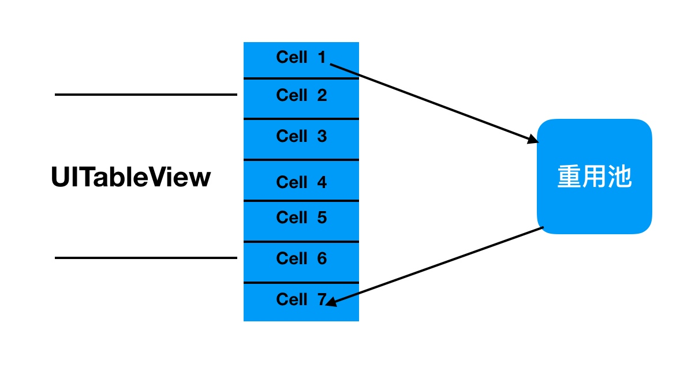

# ReusePool
视图重用池

重用池原理：

把移出屏幕的视图添加到重用池，在即将显示的时候把视图从重用池取出。如果重用池没有就创建一个。


```
class ViewReusePool: NSObject {
    
    ///MARK: - Open func

    /// 从重用池取一个可重用的view
    ///
    /// - Returns: 取出的视图
    func deqeueReuseableView() -> UIView? {
        if let view = waitUsedQueue.first {
            waitUsedQueue.remove(view)
            usingUsedQueue.insert(view)
            return view
        }
        return nil
    }
    
    
    /// 向重用池添加视图
    ///
    /// - Parameter view: 被添加的视图
    func addUsingView(_ view: UIView) {
        usingUsedQueue.insert(view)
    }
    
    
    /// 重置方法，将当前使用中的视图移动到可重用队列中
    func reset() {
        while let view = usingUsedQueue.first {
            usingUsedQueue.remove(view)
            waitUsedQueue.insert(view)
        }
    }
    
    
    //MARK: - private property
    
    /// 等待使用的队列
    private var waitUsedQueue:Set<UIView> = Set();
    /// 使用中的队列
    private var usingUsedQueue:Set<UIView> = Set();
    
    
    
    override init() {
        print("...")
    }
}
```

简单的使用例子：

```
protocol IndexedTableViewDataSouce: class{
    
    /// 获取一个tableView的字母索引数据的方法
    ///
    /// - Parameter tableView: 索引TableView
    /// - Returns: titles 数据源
    func indexTitlesForIndexTableView(_ tableView: IndexedTableView) -> [String]
}

class IndexedTableView: UITableView {

    //MARK: - Open property
    
    weak var indexedDataSource: IndexedTableViewDataSouce?
    
    //MARK: - Private property
    private lazy var containerView:UIView = {
        let containerView = UIView(frame: .zero)
        containerView.backgroundColor = UIColor.white
        self.superview?.insertSubview(containerView, aboveSubview: self)
        return containerView
    }()
    private var reusePool: ViewReusePool = ViewReusePool()
    
    
    override func reloadData() {
        super.reloadData()
        
        // 标记所有视图为可重用状态
        reusePool.reset()
        
        // reload字母索引条
        reloadIndexBar()
    }
}

extension IndexedTableView {
    func reloadIndexBar() {
        var arrayTitles = [String]()
        if let indexedDataSource = indexedDataSource {
            arrayTitles = indexedDataSource.indexTitlesForIndexTableView(self)
        }
        
        // 判断字母索引条是否为空
        guard !arrayTitles.isEmpty else {
             containerView.isHidden = true
            return
        }
        
        // 创建显示button
        let buttonWidth:CGFloat = 60.0
        let buttonHeight:CGFloat = self.frame.size.height / CGFloat(arrayTitles.count)
        
        for (index,title) in arrayTitles.enumerated() {
            var tempButton: UIButton
            if let button = reusePool.deqeueReuseableView() as? UIButton{
                // button 重用
                tempButton = button
                print("button 重用")
            } else {
                // 没有可重用的，创建一个
                let button = UIButton(frame: .zero)
                button.backgroundColor = UIColor.white
                reusePool.addUsingView(button)
                tempButton = button
                print("button 新建")
            }
            
            containerView.addSubview(tempButton)
            tempButton.setTitle(title, for: .normal)
            tempButton.setTitleColor(UIColor.black, for: .normal)
            tempButton.frame = CGRect(x: 0, y: CGFloat(index) * buttonHeight, width: buttonWidth, height: buttonHeight)
            
        }

        containerView.isHidden = false
        containerView.frame = CGRect(x: self.frame.origin.x + self.frame.size.width - buttonWidth, y: self.frame.origin.y, width: buttonWidth, height: self.frame.origin.y)
        
    }
}
```